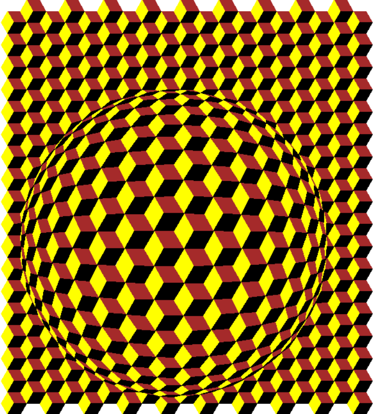

# Vasarely Project 🎨

<p align="center">
  
</p>


This project was developed at **Université libre de Bruxelles (ULB)** as part of a coursework assignment inspired by the optical art of **Victor Vasarely**.  
It explores **algorithmic and generative design**, focusing on geometric patterns, symmetry, and color composition.

---

## 🧠 Project Overview

The goal of this project is to reproduce the visual style of Vasarely’s artworks using programming techniques.  
It combines **mathematical logic** and **artistic creativity** to generate abstract and dynamic compositions.

---

## ⚙️ Technologies Used

- **Language:** (Python)
- **Libraries:** (turtle,math,deformation)
- **IDE / Tools:** (Visual Studio Code, Python 3 interpreter)

---

## 🖼️ Features

- Generation of geometric patterns and color gradients  
- Simulation of optical illusions (depth, motion, symmetry)  
- Parameter customization (colors, shapes, density, etc.)  
- Export or visualization of the generated artworks  

---

## 🚀 Usage

1. Clone the repository:
   ```bash
   git clone https://github.com/rtektas/Vasarely-ULB-.git

2. Open the project in your IDE or run the main script:
   ```bash
   python vasarely.py


## 👩‍🎨 Inspiration

The project is inspired by Victor Vasarely (1906–1997), a pioneer of Op Art (Optical Art).
His work demonstrates how mathematical structure and artistic intuition can blend to produce visually stunning patterns.

## 🧾 License

This project was created for educational purposes at ULB.
You are free to use and modify it for non-commercial or academic use.
   
